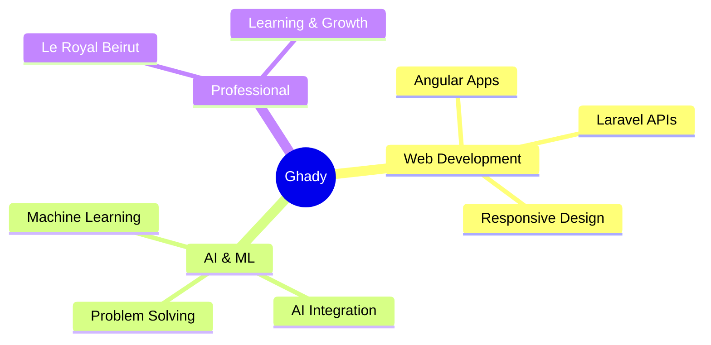

<div align="center">

<!-- Header Banner -->


<!-- Animated Typing -->
<a href="https://git.io/typing-svg"></a>

<!-- Social Badges -->
<p align="center">
  <a href="https://ghady7.github.io/dashboard/index.html">
    
  </a>
  <a href="https://www.linkedin.com/in/ghady-tayeh-a0711a339/">
    
  </a>
  <a href="https://www.instagram.com/ghady_tayeh/">
    
  </a>
</p>

<!-- Profile Stats -->
<p align="center">
  
  
</p>

</div>

<br/>

<!-- About Section -->
##  About Me

```typescript
const ghady = {
    location: "Beirut, Lebanon 🇱🇧",
    role: "Software Web Developer",
    company: "Le Royal Beirut",
    currentFocus: ["AI Integration", "Web Development", "Problem Solving"],
    learning: ["Machine Learning", "AI Solutions"],
    funFact: "Turning coffee into code ☕"
};
```


<br/>

<!-- Tech Stack -->
##  Technology Stack

<div align="center">

### Frontend


### Backend


### Database


### Tools


</div>


<br/>

<!-- Projects Section -->
##  Featured Projects

<div align="center">

<table>
<tr>
<td width="50%" style="padding: 20px; border-radius: 15px;">

<div style="background: linear-gradient(135deg, #667eea 0%, #764ba2 100%); border-radius: 15px; padding: 20px;">

### 📦 Order Manager
**Full-stack order management system**

- Real-time order tracking
- Analytics dashboard
- Secure authentication
- Responsive design

`Angular` `Laravel` `MySQL`

[](https://github.com/ghady7/Order_Manager)

</div>

</td>

<td width="50%" style="padding: 20px; border-radius: 15px;">

<div style="background: linear-gradient(135deg, #f093fb 0%, #f5576c 100%); border-radius: 15px; padding: 20px;">

### 🏭 Inventory Manager
**Smart inventory control system**

- Real-time stock monitoring
- Automated alerts
- Analytics & reports
- Multi-user support

`Angular` `PHP` `MySQL`

[](https://github.com/ghady7/Inventory_Manager)

</div>

</td>
</tr>

<tr>
<td width="50%" style="padding: 20px; border-radius: 15px;">

<div style="background: linear-gradient(135deg, #4facfe 0%, #00f2fe 100%); border-radius: 15px; padding: 20px;">

### 📚 Library System
**Digital library management**

- Advanced search
- User management
- Booking system
- Usage statistics

`Java` `MySQL`

[](https://github.com/ghady7/Library_System)

</div>

</td>

<td width="50%" style="padding: 20px; border-radius: 15px;">

<div style="background: linear-gradient(135deg, #fa709a 0%, #fee140 100%); border-radius: 15px; padding: 20px;">

### 🎨 Portfolio & CV
**Interactive personal dashboard**

- Modern UI/UX
- Fully responsive
- Skills visualization
- Downloadable CV

`HTML5` `CSS3` `JavaScript`

[](https://ghady7.github.io/dashboard/index.html)

</div>

</td>
</tr>
</table>

<br/>

<a href="https://github.com/ghady7?tab=repositories">
  
</a>

</div>


<br/>

<!-- GitHub Stats -->
##  GitHub Statistics

<div align="center">


<br/><br/>


<br/><br/>


<br/><br/>


</div>


<br/>

<!-- Current Focus -->
##  What I'm Up To

<div align="center">



</div>

<br/>

<div align="center">

**🔭 Currently working on:** AI-powered web applications at Le Royal Beirut  
**🌱 Currently learning:** Machine Learning & AI Solutions  
**💬 Ask me about:** Angular, Laravel, Java, Python  
**⚡ Fun fact:** I debug with console.log() and I'm proud of it! 😄

</div>


<br/>

<!-- Connect -->
##  Let's Connect

<div align="center">

<p>
  
  
</p>

<a href="https://www.linkedin.com/in/ghady-tayeh-a0711a339/">
  
</a>
<a href="https://ghady7.github.io/dashboard/index.html">
  
</a>
<a href="https://www.instagram.com/ghady_tayeh/">
  
</a>

<br/><br/>

### 💡 "Building the future, one commit at a time"

<br/>

### 📬 Let's build something amazing together!

</div>


<!-- Footer -->


<div align="center">

### ⭐️ From [ghady7](https://github.com/ghady7) | Built with 💜 and ☕

</div>
