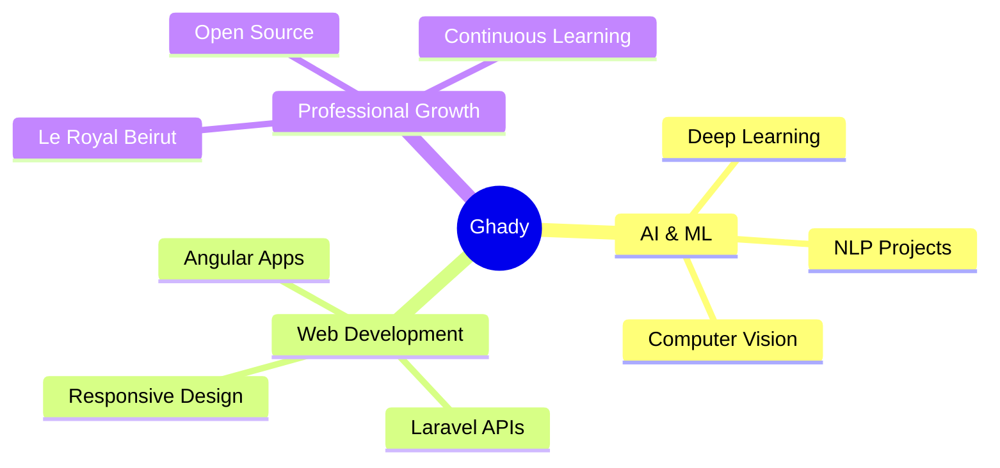

<div align="center">

# 🚀 Ghady Tayeh

### Software Web Developer | AI Enthusiast | Innovation Seeker


[](https://ghady7.github.io/dashboard/index.html)
[](https://www.linkedin.com/in/ghady-tayeh-a0711a339/)
[](https://www.instagram.com/ghady_tayeh/)

</div>

---

## 👨‍💻 About Me

```typescript
const ghady = {
    location: "Beirut, Lebanon 🇱🇧",
    role: "Software Web Developer @ Le Royal Beirut",
    currentFocus: ["AI Integration", "Modern Web Apps", "Clean Architecture"],
    learning: ["Machine Learning", "AI Solutions", "Cloud Technologies"],
    funFact: "Turning coffee into code since... well, every morning ☕"
};
```

<div align="center">

### 🎯 Current Mission
**Bridging the gap between cutting-edge AI and practical web solutions**

</div>

---

## 🛠️ Tech Arsenal

<div align="center">

### Frontend Magic


### Backend Power


### Developer Tools


</div>

---

## 💼 Featured Projects

<div align="center">

<table>
<tr>
<td width="50%">

### 📦 Order Manager
**Full-stack order management system**

[](https://github.com/ghady7/Order_Manager)

Built with modern architecture for seamless order processing and tracking

</td>
<td width="50%">

### 🏭 Inventory Manager
**Smart inventory control system**

[](https://github.com/ghady7/Inventory_Manager)

Real-time inventory management with analytics dashboard

</td>
</tr>
<tr>
<td width="50%">

### 📚 Library System
**Digital library management**

[](https://github.com/ghady7/Library_System)

Complete library system with user authentication and search

</td>
<td width="50%">

### 🎨 More Projects
**Check out my portfolio**

[](https://ghady7.github.io/dashboard/index.html)

Explore my complete dashboard and CV

</td>
</tr>
</table>

</div>

---

## 📊 GitHub Analytics

<div align="center">
  
  
</div>

<div align="center">
  
</div>

<div align="center">
  
</div>

---

## 🎯 What I'm Up To



---

## 🌟 Let's Connect & Collaborate

<div align="center">

**Open to exciting opportunities, collaborations, and innovative projects!**

[](mailto:your.email@example.com)
[](https://www.linkedin.com/in/ghady-tayeh-a0711a339/)
[](https://www.instagram.com/ghady_tayeh/)

</div>

---

<div align="center">

### 💡 "Building the future, one commit at a time"


⭐️ From [ghady7](https://github.com/ghady7)

</div>
