```mermaid
mindmap
  root((🎯 Ghady Tayeh))
    🤖 AI & Machine Learning
      Deep Learning Frameworks
      Natural Language Processing
      Computer Vision Projects
      AI Model Integration
    💻 Web Development
      Angular Applications
      Laravel API Development
      Microservices Architecture
      Progressive Web Apps
    ☁️ Cloud & DevOps
      AWS Services
      Docker Containerization
      CI/CD Pipelines
      Kubernetes Orchestration
    🚀 Professional Growth
      Le Royal Beirut Projects
      Open Source Contributions
      Tech Community Engagement
      Continuous Learning
```

<div align="center">

<!-- Header Banner -->


<!-- Animated Typing -->
<a href="https://git.io/typing-svg"></a>

<!-- Social Badges with Hover Effect -->
<p align="center">
  <a href="https://ghady7.github.io/dashboard/index.html">
    
  </a>
  <a href="https://www.linkedin.com/in/ghady-tayeh-a0711a339/">
    
  </a>
  <a href="https://www.instagram.com/ghady_tayeh/">
    
  </a>
  <a href="https://github.com/ghady7">
    
  </a>
</p>

<!-- Profile Views & Visitors -->
<p align="center">
  
  
</p>

</div>

<br/>

<!-- About Section with Visual Elements -->
##  About Me

```yaml
name: Ghady Tayeh
located_in: Beirut, Lebanon
current_job: Software Web Developer
company: Le Royal Beirut
education:
  - "Continuous Learning in AI & Machine Learning"
  - "Modern Web Development & Architecture"
  
fields_of_interest:
  - "Artificial Intelligence & ML Integration"
  - "Full-Stack Web Development"
  - "Cloud-Native Applications"
  - "System Architecture & Design"
  - "DevOps & Automation"

currently_learning:
  - "Advanced AI/ML Algorithms"
  - "Microservices Architecture"
  - "Cloud Computing (AWS/Azure)"
  
hobbies: ["Coding", "Tech Innovation", "Problem Solving", "Open Source"]
```


<br/>

<!-- Tech Stack with Categories -->
##  Technology Stack

<details open>
<summary><b>🎨 Frontend Development</b></summary>
<br/>


</details>

<details open>
<summary><b>⚙️ Backend Development</b></summary>
<br/>


</details>

<details open>
<summary><b>💾 Database & Cloud</b></summary>
<br/>


</details>

<details open>
<summary><b>🛠️ Tools & Technologies</b></summary>
<br/>


</details>

<details open>
<summary><b>🤖 AI & Machine Learning</b></summary>
<br/>


</details>


<br/>

<!-- Featured Projects Section -->
##  Featured Projects

<div align="center">

<table>
<tr>
<td width="50%" valign="top">

### 📦 Order Management System
[](https://github.com/ghady7/Order_Manager)

**Enterprise-grade order processing platform**

- 🚀 Real-time order tracking & management
- 📊 Advanced analytics dashboard
- 🔐 Secure authentication system
- 📱 Responsive design for all devices

**Tech Stack:**  
`Angular` `Laravel` `MySQL` `REST API`

[](https://github.com/ghady7/Order_Manager)
[](https://github.com/ghady7/Order_Manager)

</td>

<td width="50%" valign="top">

### 🏭 Inventory Control System
[](https://github.com/ghady7/Inventory_Manager)

**Smart warehouse & inventory solution**

- 📦 Real-time stock monitoring
- 🔔 Automated alerts & notifications
- 📈 Predictive analytics
- 🔄 Multi-warehouse support

**Tech Stack:**  
`Angular` `PHP` `MySQL` `Chart.js`

[](https://github.com/ghady7/Inventory_Manager)
[](https://github.com/ghady7/Inventory_Manager)

</td>
</tr>

<tr>
<td width="50%" valign="top">

### 📚 Digital Library Platform
[](https://github.com/ghady7/Library_System)

**Modern library management solution**

- 📖 Advanced search & filtering
- 👥 User role management
- 📅 Booking & reservation system
- 📊 Usage statistics & reports

**Tech Stack:**  
`Java` `Spring Boot` `MySQL` `Bootstrap`

[](https://github.com/ghady7/Library_System)
[](https://github.com/ghady7/Library_System)

</td>

<td width="50%" valign="top">

### 🎯 Complete Portfolio
[](https://ghady7.github.io/dashboard/index.html)

**Interactive personal dashboard**

- 🎨 Modern UI/UX design
- 📱 Fully responsive layout
- 🌙 Dark/Light theme toggle
- 📊 Skills visualization
- 📄 Downloadable CV

**Tech Stack:**  
`HTML5` `CSS3` `JavaScript` `Chart.js`

[](https://ghady7.github.io/dashboard/index.html)
[](https://github.com/ghady7)

</td>
</tr>
</table>

<a href="https://github.com/ghady7?tab=repositories">
  
</a>

</div>


<br/>

<!-- GitHub Statistics -->
##  GitHub Analytics

<div align="center">

<!-- Main Stats -->


<!-- Streak Stats -->


<!-- Activity Graph -->


<!-- Trophy -->


</div>


<br/>

<!-- Current Focus -->
##  Current Focus & Goals

<div align="center">



</div>

<br/>

<!-- Current Activity -->
<details open>
<summary><b>🔥 Current Activities</b></summary>
<br/>

- 🔭 Working on AI-powered web applications at **Le Royal Beirut**
- 🌱 Learning advanced **Machine Learning** algorithms and **Cloud Architecture**
- 👯 Looking to collaborate on innovative **Open Source** projects
- 💬 Ask me about **Angular, Laravel, Java, Python, or AI Integration**
- 📫 Reach me at: **[LinkedIn](https://www.linkedin.com/in/ghady-tayeh-a0711a339/)**
- ⚡ Fun fact: I debug with console.log() and I'm not ashamed! 😄

</details>


<br/>

<!-- Connect Section -->
##  Let's Connect & Collaborate

<div align="center">

<p>
  
  
  
</p>

### 💼 Professional Network

<a href="https://www.linkedin.com/in/ghady-tayeh-a0711a339/">
  
</a>
<a href="mailto:your.email@example.com">
  
</a>
<a href="https://ghady7.github.io/dashboard/index.html">
  
</a>

### 🌐 Social Media

<a href="https://www.instagram.com/ghady_tayeh/">
  
</a>
<a href="https://github.com/ghady7">
  
</a>

<br/><br/>

### 💡 "Code is like humor. When you have to explain it, it's bad." – Cory House

<br/>

### 📬 Interested in collaborating? Let's build something amazing together!

</div>


<!-- Footer Wave -->


<div align="center">

### ⭐️ From [ghady7](https://github.com/ghady7) | Built with 💜 and lots of ☕

</div>
