```mermaid
mindmap
  root((🎯 Ghady<br/>Tayeh))
    🤖 AI Integration
      Machine Learning
      Intelligent Systems
      Predictive Analytics
      Data-Driven Solutions
    💻 Web Development
      Scalable Architecture
      Modern Frameworks
      RESTful APIs
      Performance Optimization
    🌐 IT Infrastructure
      Network Design
      Data Processing
      System Maintenance
      Security Implementation
    🚀 Innovation
      Problem Solving
      Continuous Learning
      Best Practices
      Future Technologies
```

<div align="center">

<!-- Animated Header with Gradient -->


<!-- Dynamic Typing Effect -->
<a href="https://git.io/typing-svg">
  
</a>

<!-- Professional Badges -->
<p align="center">
  <a href="https://ghady7.github.io/dashboard/index.html">
    
  </a>
  <a href="https://www.linkedin.com/in/ghady-tayeh-a0711a339/">
    
  </a>
  <a href="https://www.instagram.com/ghady_tayeh/">
    
  </a>
  <a href="https://github.com/ghady7">
    
  </a>
</p>

<!-- Live Stats -->
<p align="center">
  
  
  
</p>

</div>

<br/>

<!-- Professional Introduction -->
##  About Me


<br/>

**Hi, I'm Ghady** — a Software and Web Developer passionate about building **efficient, scalable, and user-focused digital solutions**. Over the past few years, I've developed a strong foundation in web development, IT systems, and networking, combining technical precision with a problem-solving mindset.

<br/>

```typescript
const ghady: Developer = {
    location: "Beirut, Lebanon 🇱🇧",
    role: "IT & Software Developer",
    currentFocus: [
        "AI & Machine Learning Integration",
        "Data-Driven Application Development",
        "Intelligent System Architecture"
    ],
    expertise: [
        "Full-Stack Web Development",
        "IT Infrastructure & Networking",
        "Data Processing & Optimization",
        "System Design & Implementation"
    ],
    pursuing: [
        "Advanced Web Development Certifications",
        "Networking & Data Processing",
        "AI/ML Specialization"
    ],
    mission: "Integrating software development expertise with " +
             "AI-driven technologies to build smarter, adaptive " +
             "applications that solve real-world problems",
    workflow: "☕ → 💻 → 🚀"
};
```

<br clear="right"/>


<br/>

<!-- Current Role Section -->
##  Current Role & Responsibilities

<table align="center">
<tr>
<td align="center" width="33%">

### 🎯 **IT & Software Developer**

Designing, implementing, and maintaining web-based systems that streamline business operations

</td>
<td align="center" width="33%">

### 🔧 **Full-Stack Development**

Building both front-end interfaces and back-end architectures with optimal performance

</td>
<td align="center" width="33%">

### 🌐 **System Optimization**

Troubleshooting and optimizing network infrastructure and data processing workflows

</td>
</tr>
</table>

<div align="center">

**📍 Impact Focus:** *Enhancing user experience through scalable, efficient, and intelligent digital solutions*

</div>


<br/>

<!-- Professional Growth Section -->
##  Professional Growth & Certifications

<div align="center">


</div>

<br/>

<table align="center">
<tr>
<td width="33%" valign="top" align="center">

### 🎓 Web Development
**Advanced Courses**


Mastering modern frameworks, architecture patterns, and software engineering principles

</td>
<td width="33%" valign="top" align="center">

### 🌐 Networking & Data
**Infrastructure Skills**


Deepening expertise in IT infrastructure, network optimization, and data processing

</td>
<td width="33%" valign="top" align="center">

### 🤖 AI & Machine Learning
**Future-Ready Skills**


Exploring intelligent systems, ML algorithms, and data-driven decision-making

</td>
</tr>
</table>

<div align="center">

### 💡 **Primary Goal**
*Integrate software development expertise with AI and data-driven technologies to build smarter, more adaptive applications that solve real-world problems*

</div>


<br/>

<!-- Tech Stack Section -->
##  Technology Arsenal

<div align="center">

### 🎨 Frontend Development
<table>
<tr>
<td align="center" width="96">

<br><b>HTML5</b>
</td>
<td align="center" width="96">

<br><b>CSS3</b>
</td>
<td align="center" width="96">

<br><b>JavaScript</b>
</td>
<td align="center" width="96">

<br><b>Angular</b>
</td>
</tr>
</table>

### ⚙️ Backend Development
<table>
<tr>
<td align="center" width="96">

<br><b>Laravel</b>
</td>
<td align="center" width="96">

<br><b>PHP</b>
</td>
<td align="center" width="96">

<br><b>Java</b>
</td>
<td align="center" width="96">

<br><b>Python</b>
</td>
</tr>
</table>

### 💾 Database & Infrastructure
<table>
<tr>
<td align="center" width="96">

<br><b>MySQL</b>
</td>
<td align="center" width="96">

<br><b>MongoDB</b>
</td>
<td align="center" width="96">

<br><b>Git</b>
</td>
<td align="center" width="96">

<br><b>GitHub</b>
</td>
<td align="center" width="96">

<br><b>VS Code</b>
</td>
</tr>
</table>

</div>


<br/>

<!-- Featured Projects -->
##  Featured Projects

<div align="center">

<table>
<tr>
<td width="50%" valign="top">

### 📦 Order Management System
[](https://github.com/ghady7/Order_Manager)

<div align="center">


</div>

**Enterprise-grade order processing platform**

✨ Real-time order tracking & analytics  
🔐 Secure authentication & authorization  
📊 Advanced business intelligence dashboard  
📱 Responsive cross-platform design  
🚀 Optimized for high-volume operations

<br>

[](https://github.com/ghady7/Order_Manager)

</td>

<td width="50%" valign="top">

### 🏭 Inventory Control System
[](https://github.com/ghady7/Inventory_Manager)

<div align="center">


</div>

**Intelligent warehouse management solution**

📦 Real-time stock monitoring & alerts  
🔔 Automated notification system  
📈 Predictive analytics & forecasting  
🔄 Multi-warehouse synchronization  
💡 Smart reorder point calculations

<br>

[](https://github.com/ghady7/Inventory_Manager)

</td>
</tr>

<tr>
<td width="50%" valign="top">

### 📚 Digital Library Platform
[](https://github.com/ghady7/Library_System)

<div align="center">


</div>

**Modern library management ecosystem**

📖 Advanced search & filtering engine  
👥 Role-based access control  
📅 Automated booking & reservations  
📊 Comprehensive usage analytics  
🔍 Intelligent catalog management

<br>

[](https://github.com/ghady7/Library_System)

</td>

<td width="50%" valign="top">

### 🎯 Interactive Portfolio
[](https://ghady7.github.io/dashboard/index.html)

<div align="center">


</div>

**Professional showcase & digital presence**

🎨 Modern, elegant UI/UX design  
📱 Fully responsive across all devices  
🌙 Dynamic theme customization  
📄 Interactive CV & project showcase  
⚡ Lightning-fast performance

<br>

[](https://ghady7.github.io/dashboard/index.html)

</td>
</tr>
</table>

<br>

<a href="https://github.com/ghady7?tab=repositories">
  
</a>

</div>


<br/>

<!-- GitHub Analytics -->
##  GitHub Analytics

<div align="center">

<a href="https://github.com/ghady7">
  
  
</a>

<br><br>

<a href="https://github.com/ghady7">
  
</a>

<br><br>

<a href="https://github.com/ghady7">
  
</a>

<br><br>


</div>


<br/>

<!-- Development Philosophy -->
##  Development Philosophy & Focus

<div align="center">



</div>

<br/>

<table align="center">
<tr>
<td align="center" width="50%">

### 🔭 **Current Focus**
Integrating AI/ML with software development  
to create **intelligent, adaptive applications**

</td>
<td align="center" width="50%">

### 🌱 **Learning Journey**
Pursuing advanced certifications in  
**AI, ML, Networking & Web Development**

</td>
</tr>
<tr>
<td align="center" width="50%">

### 💬 **Ask Me About**
Full-Stack Development • IT Systems  
Network Optimization • AI Integration

</td>
<td align="center" width="50%">

### ⚡ **Development Mindset**
*"Code with purpose, debug with patience,  
deploy with confidence"* 🚀

</td>
</tr>
</table>


<br/>

<!-- Connect Section -->
##  Let's Connect & Collaborate

<div align="center">


<br><br>

### 💼 Professional Network

<a href="https://www.linkedin.com/in/ghady-tayeh-a0711a339/">
  
</a>
<a href="https://ghady7.github.io/dashboard/index.html">
  
</a>

<br><br>

### 🌐 Social Presence

<a href="https://www.instagram.com/ghady_tayeh/">
  
</a>
<a href="https://github.com/ghady7">
  
</a>

<br><br>

### 💡 *"Building intelligent solutions, one commit at a time"*

<br/>

**📬 Interested in collaboration, consulting, or discussing innovative projects?**  
**Let's create something extraordinary together!**

</div>


<br/>

<!-- Footer Wave -->


<div align="center">

### ⭐️ From [ghady7](https://github.com/ghady7) | Crafted with 💜 and powered by ☕

**Thanks for visiting! If you find my work valuable, consider leaving a ⭐ on my projects!**


</div>
